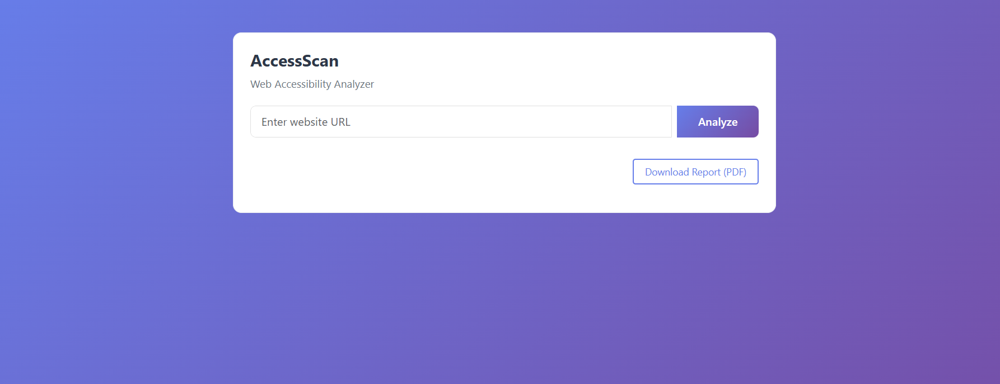
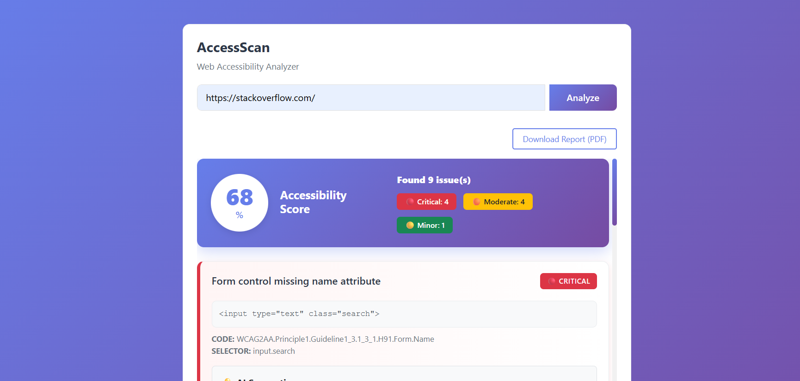
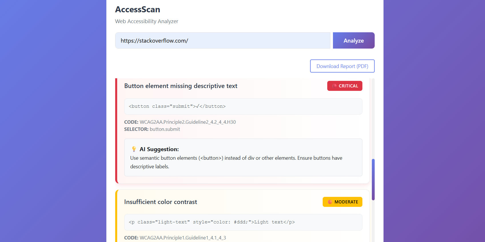

---

# 🌐 AccessScan – AI-Powered Web Accessibility Analyzer

Analyze website accessibility, generate structured reports, and receive AI-powered remediation suggestions.

AccessScan is a full-stack web application that evaluates website URLs for accessibility violations using automated testing tools. It categorizes issues by severity, calculates an accessibility score, and enhances reports with AI-generated fix suggestions.

🔗 **Live Demo:** [https://accessscan-1.onrender.com/](https://accessscan-1.onrender.com/)

---

## 🚀 Features

* 🔍 Analyze any public website URL for accessibility issues
* 📊 Generate an overall Accessibility Score
* 🟢 Categorize issues by severity:

  * Critical (Red)
  * Moderate (Yellow)
  * Minor (Green)
* 🤖 AI-powered fix suggestions
* 📄 Download structured PDF report
* 🎨 Clean, color-coded user interface
* 🌍 Fully deployed and publicly accessible

---

## 🛠️ Tech Stack

| Frontend              | Backend             | Accessibility Engine | AI Integration   | Deployment |
| --------------------- | ------------------- | -------------------- | ---------------- | ---------- |
| HTML, CSS, JavaScript | Node.js, Express.js | Pa11y                | Hugging Face API | Render     |

---

## ⚙️ System Workflow

1. User submits a website URL.
2. Backend scans the website using Pa11y.
3. Issues are classified based on severity.
4. Accessibility score is calculated.
5. AI generates contextual improvement suggestions.
6. A downloadable PDF report is generated.

---

## 📸 Screenshots

### 🏠 Home Page



### 📋 Accessibility Report



### 🤖 AI Fix Suggestions



---

## 💻 Local Setup

### 1️⃣ Clone the Repository

```bash
git clone https://github.com/your-username/AccessScan.git
cd AccessScan
```

### 2️⃣ Install Dependencies

```bash
npm install
```

### 3️⃣ Start the Server

```bash
npm start
```

Open your browser and visit:

```
http://localhost:5000
```

---

## 📈 Project Highlights

* Automated accessibility scanning
* AI-enhanced remediation guidance
* PDF report generation for audit documentation
* Production deployment experience

---

## 👩‍💻 Author

**Kusheen Dhar**
Full Stack Developer

---


